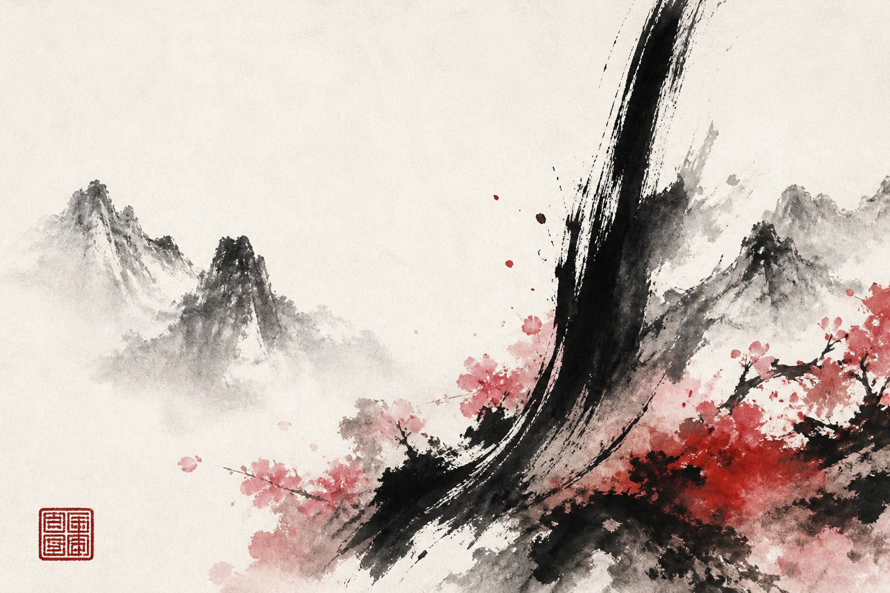

<!--
  ============================================================
  PROFILE README — g-sat / 王令 Wang Ling / Sathwik Garikapati
  Repo: github.com/g-sat/g-sat  →  README.md at root
  ============================================================
-->

<!-- LOGO -->

 

<!-- TRADITIONAL INK BANNER -->

 

 

  

---

### 王令 · WANG LING
**Sathwik Garikapati** · creative technologist

I'm a website designer & AI/ML developer shipping **maximalist, future-facing products** —
**Three.js / R3F** sculpture, custom shaders, **GSAP** motion systems, and interfaces where
human experience meets machine intelligence.

墨 · 粉 · 硃 · 白 → black void · pink neon · cinnabar red · pure white

`數位工藝 DIGITAL CRAFT` · `人工智能 AI SYSTEMS` · `人機之間 HUMAN × MACHINE`

---

### ◈ What I bring · 核心能力

| Signal | Detail |
|:---|:---|
| **Design × Engineer** | Visual system + React/Three pipeline in the same PR |
| **3D as interface** | GLTF heroes, pointer sway, shader materials — product, not demo |
| **AI / ML wiring** | Inference, CV, data products into real UIs |
| **Motion systems** | GSAP timelines · Motion · scroll theater with intent |

<b>Engineering highlights · 工程亮點</b>

 

- **Portfolio** — Next.js 16 · React 19 · R3F bust · shaders · GSAP wipes · contribution graph
- **MedRDM** — rare-disease diagnosis product direction
- **Face Emotion Recognition** — CV / ML recognition pipeline
- **STUDY-COMPANION** — learning tooling at the product layer

---

### ◈ Tech Stack · 技術棧

**Languages**

  
  
  
  
  

**Frontend · 3D · Motion**

  
  
  
  
  
  
  

**AI / ML · Data**

  
  
  
  

**Tools · Ship**

  
  
  
  
  
  

---

### ◈ Featured Work · 精選作品

<table>
  <tr>
    <td width="50%" valign="top">
      <h3><a href="https://github.com/g-sat/portfolio">portfolio</a></h3>
      
      
      
        
      Maximalist portfolio — Next · R3F · shaders · GSAP · Motion
        
      
    </td>
    <td width="50%" valign="top">
      <h3><a href="https://github.com/g-sat/MedRDM">MedRDM</a></h3>
      
      
        
      Health / ML — rare-disease diagnosis surface
        
      
    </td>
  </tr>
  <tr>
    <td width="50%" valign="top">
      <h3><a href="https://github.com/g-sat/Face-emotion-Recognition">Face-emotion-Recognition</a></h3>
      
      
        
      Computer vision — emotion recognition pipeline
        
      
    </td>
    <td width="50%" valign="top">
      <h3><a href="https://github.com/g-sat/STUDY-COMPANION">STUDY-COMPANION</a></h3>
      
      
        
      Learning companion — study tooling
        
      
    </td>
  </tr>
</table>

---

### ◈ GitHub Stats · 數據

  

---

### ◈ Live Contributions · 貢獻軌跡

<picture>
  <source media="(prefers-color-scheme: dark)" srcset="https://raw.githubusercontent.com/g-sat/g-sat/output/github-snake-dark.svg"/>
  <source media="(prefers-color-scheme: light)" srcset="https://raw.githubusercontent.com/g-sat/g-sat/output/github-snake.svg"/>
  
</picture>

Snake unlocks after <code>.github/workflows/snake.yml</code> runs once.

---

### ◈ Currently · 此刻

- **Working on** — futuristic portfolio systems · 3D · GSAP · AI surfaces
- **Learning** — shader craft · production R3F performance
- **Open to** — design-engineering · AI integration · worldwide collab
- **Fun fact** — classical bust that breathes inside a pink-red void

---

  

  

`極致之美。極致之狂。`  
**maximal beauty · maximal insanity**  
**王令 · Wang Ling** — g-sat

